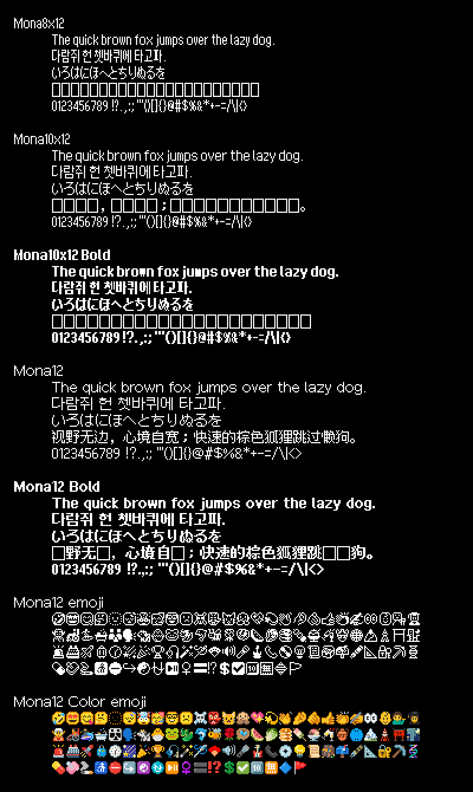
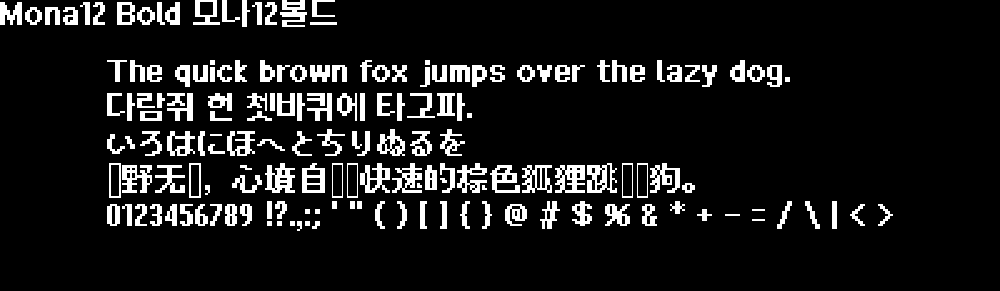

[English](./README.md) | [한국어](./README-KO.md)

# Mona Font

Mona Font는 다국어 텍스트, 특수 기호, 이모지를 함께 지원하는 픽셀 스타일 폰트입니다.

## 특징

- 지역별로 다른 한자 자형을 OpenType `locl` 기능을 통해 지원합니다.
- 라틴 문자에 대해 커닝이 적용되어 있습니다.
- 컬러 이모지와 흑백 이모지 포함.

## 폰트 미리보기

[사용해 보기](https://monadabxy.com/fonts/mona/)

### Mona12



### Mona12 Bold



## 다운로드

[최신 버전 다운로드](https://github.com/MonadABXY/mona-font/releases/latest)

사용 환경에 맞춰 적절한 폰트 파일을 선택하세요.

| 파일명                     | 설명                                                       |
| :------------------------- | :--------------------------------------------------------- |
| **Mona12.ttf**             | 텍스트 + 이모지 통합 폰트                                  |
| **Mona12Text{Region}.ttf** | 특정 지역 자형으로 고정된 텍스트 전용 폰트 (`locl` 미사용) |
| **Mona12ColorEmoji.ttf**   | 컬러 이모지 전용                                           |
| **Mona12Emoji.ttf**        | 흑백 이모지 전용                                           |

## 웹폰트 적용

### `<link>`

```html
<link rel="stylesheet" href="https://cdn.jsdelivr.net/gh/MonadABXY/mona-font/web/mona.css" />
```

### `@import`

```css
@import url("https://cdn.jsdelivr.net/gh/MonadABXY/mona-font/web/mona.css");
```

## 지원 범위

| 항목                | Mona10 | Mona10 Bold | Mona12 | Mona12 Bold |
| ------------------- | ------ | ----------- | ------ | ----------- |
| 한글 음절           | ❌     | ❌          | ✅     | ✅          |
| 라틴 문자           | ❌     | ❌          | ✅     | ✅          |
| 한자                | ❌     | ❌          | ✅     | ❌          |
| 히라가나 / 가타카나 | ❌     | ❌          | ✅     | ✅          |
| 그리스 문자         | ❌     | ❌          | ✅     | ❌          |
| 키릴 문자           | ❌     | ❌          | ✅     | ❌          |
| 특수 문자 / 기호    | ❌     | ❌          | ✅     | ❌          |
| 흑백 이모지         | ❌     | ❌          | ✅     | ❌          |
| 컬러 이모지         | ❌     | ❌          | ✅     | ❌          |

정확한 문자 목록은 아래에서 확인할 수 있습니다.

[지원 범위 상세](./docs/GLYPHS.md)

## 라이선스 및 크레딧

### 라이선스

**Mona Font**는 [SIL 오픈 폰트 라이선스 1.1](https://openfontlicense.org/) 하에 배포됩니다.

개인 및 기업 사용자를 포함한 누구나 자유롭게 사용, 수정 및 재배포할 수 있습니다.

단, 폰트 파일 자체를 단독으로 유료 판매하는 것은 금지됩니다.

- [OFL 1.1 원문](./OFL.txt)
- [OFL 1.1 한국어 번역](./OFL-KO.txt)

### 크레딧 및 오픈소스 고지

#### 1. Google Noto Emoji

- **사용 범위**: 컬러 팔레트 및 국기(Flags) 이모지
- **License**: SIL Open Font License 1.1 (Fonts) / Apache License 2.0 (Tools/Images)
- **Source**: [googlefonts/noto-emoji](https://github.com/googlefonts/noto-emoji)

#### 2. Ark Pixel Font

- **사용 범위**: 한자(CJK Ideographs) 영역의 글리프
- **License**: SIL Open Font License 1.1
- **Source**: [TakWolf/ark-pixel-font](https://github.com/TakWolf/ark-pixel-font)
